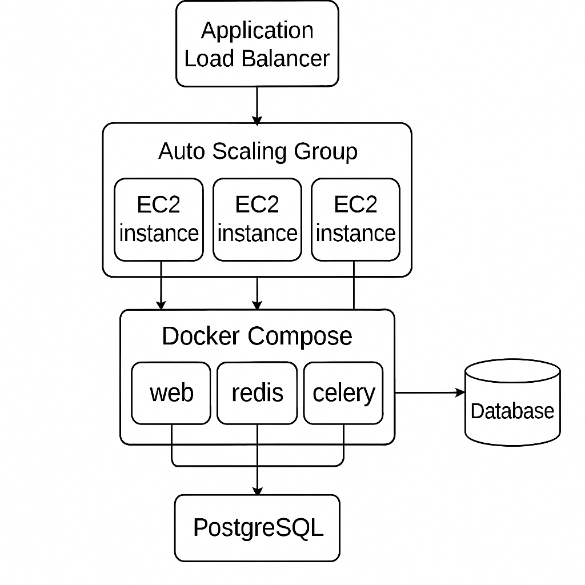

# Django Microservice with Celery, Redis, Docker & AWS 

##  Overview

Overview
This project is a Django-based microservice that provides a REST API for processing background tasks using Celery and Redis. The application is containerized with Docker and includes infrastructure as code for AWS deployment.

The application was built to be Highly available and Scalable By using Auto Scaling group to launch new instances in response to High traffic and there is also Application Load Balancers to route traffic to healthy instances
it  expose:
- **GET** `/api/public-health-check/` — returns the health of our application (the health check endpoint).
-  **POST** `/api/register/` — accepts `{ "username": "...", "password": "...", "email": "..." } -registration of our application
-  **POST** `/api/token/` — accepts `{ "username": "...", "password": "...", "email": "..." } -login endpoint 
- **POST** `/api/process/` — accepts `{ "email": "...", "message": "..." }`, enqueues a Celery task via Redis.  
    Requires Authorization: Bearer jwt_token_here
- **GET** `/api/status/<task_id>/` — returns task status and result.
   Requires Authorization: Bearer jwt_token_here

Containerized (web, Redis, Celery, Postgres), deployed to AWS EC2 via Terraform, CI/CD via GitHub Actions.

---

Features
REST API endpoint to submit background tasks

Celery worker for asynchronous task processing

Redis as message broker

Task status tracking

Dockerized environment

AWS deployment ready

CI/CD pipeline integration

Prerequisites
Docker and Docker Compose

AWS account (for deployment)

Python 3.8+

Terraform 

Set up

# Clone the Dockerized Django repo:
git clone https://github.com/olugben/Queue.git
cd Queue

# Start everything( you must have docker installed):
docker-compose up --build

# In another terminal (after containers are up):
docker-compose exec web python manage.py migrate

Project Deployment Guide with Terraform

Prerequisites
The resources was deployed in US west 2
AWS Account with IAM permissions

Terraform installed (v2.0+)

AWS CLI configured (aws configure)

Key Pair created in us-west-2 (replace my-terraform-key in code)

2. Initialize Terraform

terraform init
This downloads required providers (AWS).

3. Review Execution Plan

terraform plan
Verify resources to be created (should show ~20 resources).

4. Deploy Infrastructure

terraform apply 

Wait ~10 minutes for full deployment.

5. Access the Application
After completion:

Get the ALB DNS:

terraform output alb_dns_name
# Example: app-lb-random-name.us-west-2.elb.amazonaws.com
Open in browser:

http://<alb_dns_name>/api/public-health-check
6. Verify Resources
AWS Console Checks:

EC2 Auto Scaling: 2 instances running

Load Balancer: Healthy targets

VPC: Public subnets in 2 AZs

SSH to Instance (Optional):

# Get instance IP from EC2 console
ssh -i "my-terraform-key.pem" ubuntu@<instance-ip>
# Check containers
sudo docker ps
# View deployment logs
cat /var/log/user-data.log
7. Destroy Resources
When finished:

terraform destroy -auto-approve
This terminates all resources!

Deployment Timeouts:

Check ASG events in EC2 console

Verify security groups allow SSH (port 22)

Health Check Failures:

# SSH into instance and check:
curl localhost:80/api/public-health-check

As last resort if the user data scripts in our launch template fail to launch ssh into instance created and run this script
cat << 'EOF' > deploy.sh
#!/bin/bash
# Strict error handling
set -euo pipefail
exec > >(tee /var/log/manual-deploy.log) 2>&1

echo "=== Starting Manual Deployment ==="

# 1. System Setup
echo "[1/6] Updating system..."
sudo apt-get update -y
sudo apt-get upgrade -y

# 2. Install Docker
echo "[2/6] Installing Docker..."
sudo apt-get install -y docker.io
sudo systemctl enable docker
sudo systemctl start docker
sudo usermod -aG docker ubuntu

# 3. Install Docker Compose
echo "[3/6] Installing Docker Compose..."
sudo curl -L "https://github.com/docker/compose/releases/download/v2.17.3/docker-compose-$(uname -s)-$(uname -m)" \
  -o /usr/local/bin/docker-compose
sudo chmod +x /usr/local/bin/docker-compose
sudo ln -sf /usr/local/bin/docker-compose /usr/bin/docker-compose

# 4. Deploy Application
echo "[4/6] Cloning repository..."
sudo rm -rf /home/ubuntu/DRFQ
git clone https://github.com/olugben/Queue.git /home/ubuntu/DRFQ

# 5. Start Containers
echo "[5/6] Launching containers..."
cd /home/ubuntu/DRFQ
sudo docker-compose down || true
sudo docker-compose up -d --build

# 6. Verification
echo "[6/6] Verifying deployment..."
sudo docker ps | grep drfq || { echo "Container not running!"; exit 1; }

echo "=== Manual deployment completed successfully ==="
EOF

# Make executable and run
chmod +x deploy.sh
./deploy.sh 

